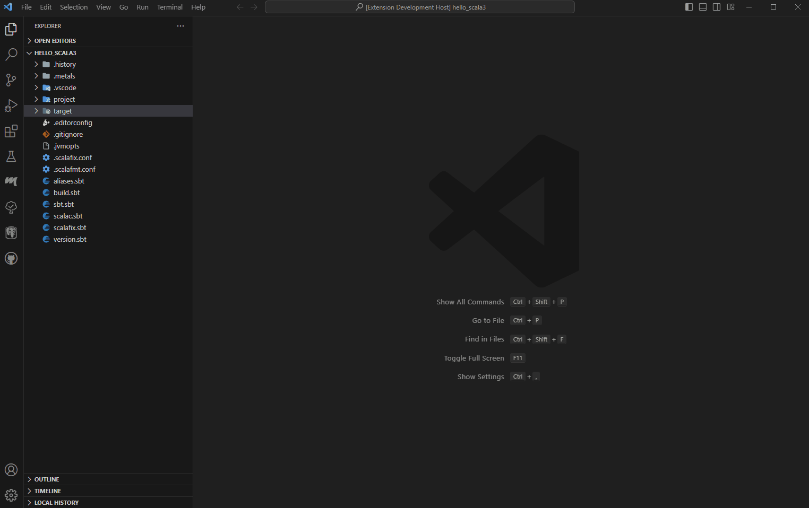

# DDD File Generator

This is an extension that creates directories and files based on layer architecture of DDD for each input domain.

I developed it to reduce the effort of repeating files and directories on Scala dev env.

## Features

* A total of 4 directories and 4 sample scala files will be created.

<!-- Describe specific features of your extension including screenshots of your extension in action. Image paths are relative to this README file.

For example if there is an image subfolder under your extension project workspace:

\!\[feature X\]\(images/feature-x.png\)

> Tip: Many popular extensions utilize animations. This is an excellent way to show off your extension! We recommend short, focused animations that are easy to follow. -->

## Commands

| Command                                           | Title                                  | Description                                                                                                                  |
| ------------------------------------------------- | -------------------------------------- | ---------------------------------------------------------------------------------------------------------------------------- |
| ddd-file-generator.createDDDStructure             | DDD:Create DDD Structure               | A package for the entered domain name is created, and each of the four layer packages and sample files are created below it. |
| ddd-file-generator.createDDDStructureWithoutFiles | DDD:Create DDD Structure Without Files | A package for the entered domain name is created, and each of the four layer packages are created below it.                  |

## Supported Languages

* Scala3

<!-- If you have any requirements or dependencies, add a section describing those and how to install and configure them. -->

<!-- ## Extension Settings

Include if your extension adds any VS Code settings through the `contributes.configuration` extension point.

For example:

This extension contributes the following settings:

* `myExtension.enable`: Enable/disable this extension.
* `myExtension.thing`: Set to `blah` to do something.

distribution command:

1. vsce package
2. vsce login ${publisher-id}
3. vsce publish

-->

## Known Issues

* Since it is created in the standard source code location of the Scala project(i.e. src/main/scala), if it is executed with a vscode command not like through the context menu, the result will be created under the path.
* Other languages may be supported in the future.

## Release Notes(without hotfix)

### 1.1.0

- Fix command name
- Add another command for it without files (ddd-file-generator.createDDDStructureWithoutFiles)
- Add configuration. Now It can be specified the default root path and the directory name of each layer in setting

### 1.0.0

Initial release to Vscode Marketplace with 1 main command

## For more information

This project is inspired by [ddd-hexagonal-generator](https://github.com/libeo-tech/ddd-hexagonal-generator) and includes part of it's code

**Enjoy!**
